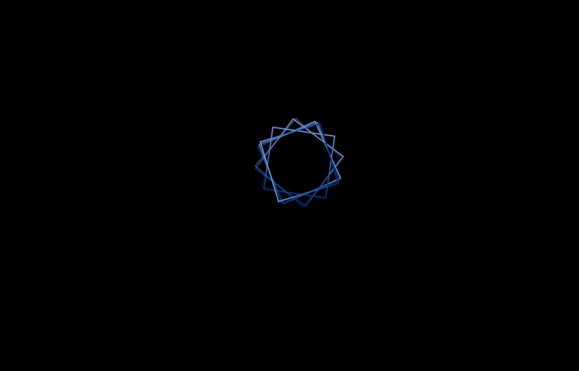

# 🎨 Rotating Gradient Squares Animation

This project showcases an eye-catching CSS animation using multiple square frames that rotate with a beautiful linear gradient border.

## 🔗 Live Demo

👉 [Live Preview Link](https://rotating-gradient-squares.vercel.app/)  
*(Replace this with your actual deployed link, e.g., from Netlify or Vercel)*

## 📸 Screenshot

  
*(Add your own screenshot image or a GIF of the animation)*

## 📁 Project Overview

- Pure HTML & CSS animation
- Rotating square frames with gradient borders
- Smooth infinite rotation
- Delay-based animation staggering
- Full-screen responsive design

## 🚀 Technologies Used

- ✅ HTML5  
- ✅ CSS3 (Flexbox, Animation, Gradient Borders)

## 🛠️ How It Works

The animation is built with:
- A centered `.wrapper` div using Flexbox
- 7 `.squre-frame` elements layered on top of each other
- Gradient border via `border-image`
- `@keyframes rotate` for 360-degree spinning
- Each frame has a delay to create a cascading visual effect

### 🌀 Key CSS Animation

```css
@keyframes rotate {
  0% {
    transform: rotate(0deg);
    opacity: 0;
  }
  25% {
    opacity: 1;
  }
  100% {
    transform: rotate(360deg);
    opacity: 1;
  }
}


📦 Folder Structure

rotating-gradient-squares/
├── index.html
└── (CSS is written inline in the HTML file)
📋 Usage
Download or clone the repository.

Open index.html in your browser.

Watch the rotating square animation in action!

🧩 Customization Ideas
Change gradient colors

Add more squares or reduce them

Vary the rotation speed and delays

Use it as a preloader or background animation

📜 License
This project is licensed under the MIT License.
Feel free to use and modify it for personal or commercial projects.

🔧 Developed by Your Name
🌐 Part of the Lifeonthecode series